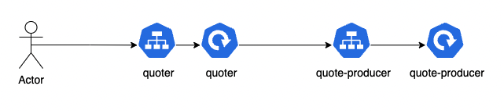

# Telepresence Demo

## Prepping the environment
### Dependencies:
- [Docker](https://docs.docker.com/)
- [kind](https://kind.sigs.k8s.io/) / [minikube](https://minikube.sigs.k8s.io/docs/start/) (we use kind in this demo) 
- [Helm](https://helm.sh/)

### Installing Telepresence
https://www.getambassador.io/docs/telepresence/latest/howtos/intercepts/

0. We'll need a cluster to connect to:
```bash
$ kind create --name telepresence-demo
```

1. Install telepresence

Follow the docs on: https://www.getambassador.io/docs/telepresence/latest/install/

2. Install Traffic Manager

When https://www.getambassador.io/docs/telepresence/latest/install/manager/

```sh
telepresence helm install
```

> If you want to see which values can be overwritten, check [the docs](https://github.com/telepresenceio/telepresence/tree/release/v2/charts/telepresence)

## Our demo App
This repo presents a really simple application, made only for demo purposes:


As you can see, this basic repo has two deployments (and two services), a `quoter` that connects to `quote-producer` service and outputs the response. 

`quote-producer` retrieves a random quote from its storage (in its simplest form, a JSON file)

### Preparing the images
#### Build images
```sh
# build quote-producer
cd src/quote-producer
docker build -t quote-producer .
```
```sh
# build quoter
cd src/quoter
docker build -t quoter .
```
```sh
# build quote-producer (dev mode), to be used as interceptor
cd src/quote-producer
docker build -f Dockerfile-dev -t interceptor .
```

#### Load images to environment
As we are running locally, we are not publishing images to any registry, just loading them into kind
```sh
kind load docker-image quoter --name telepresence-demo
kind load docker-image quote-producer --name telepresence-demo
# notice that interceptor will be used locally and it isn't uploaded anywhere
```

## Demo time!
First, let's start our workloads in the cluster:
```sh
kubectl apply -f src/manifests/all.yaml
# You should see something like this: 
kubectl get all
NAME                                  READY   STATUS    RESTARTS   AGE
pod/quote-producer-5c599866bf-jcdt7   1/1     Running   0          34m
pod/quoter-88c9cb5d-qfxdd             1/1     Running   0          34m

NAME                         TYPE        CLUSTER-IP      EXTERNAL-IP   PORT(S)    AGE
service/quote-producer-svc   ClusterIP   10.96.114.107   <none>        3000/TCP   34m
service/quoter               ClusterIP   10.96.202.255   <none>        3000/TCP   34m

NAME                             READY   UP-TO-DATE   AVAILABLE   AGE
deployment.apps/quote-producer   1/1     1            1           34m
deployment.apps/quoter           1/1     1            1           34m

NAME                                        DESIRED   CURRENT   READY   AGE
replicaset.apps/quote-producer-5c599866bf   1         1         1       34m
replicaset.apps/quoter-88c9cb5d             1         1         1       34m

```


We'll use a helper image to execute cURLs from within the cluster
```sh
kubectl run curler -it --rm --image=curlimages/curl --restart=Never -- sh
```

When we execute the curl, we'll see a strange response:
```sh
curl http://quoter:3000/quote
# {"author":"me","quote":"won't say a thing"}
```

So, let's intercept the service and check:
```sh
# make sure you are on ./src/quote-producer (since well mount a volume for the docker image)

# intercept :)
telepresence intercept quote-producer --port 8888:http

#start docker image interceptor (it's a dev image, so it has hot-reloading)
docker run -p 8888:3000 --rm -it -v $(pwd):/usr/src/app interceptor
```

Now, check the code on ./src/quote-producer and notice that there's a FAIL flag: 
```js
// ./src/quote-producer/server.js
'use strict';

const express = require('express');
const fs = require('fs');

// Constants
[...]
// change FAIL flag to fix :)
const FAIL = true;

```

Disable it, and execute the curl again:
```sh
curl http://quoter:3000/quote
# {"text":"Well done is better than well said.","author":"Benjamin Franklin"}
```

### A note on env variables
If your workload uses env vars, you can tell telepresence to output them for you to a file and then load them in the running docker image:
```sh
# make sure you are on ./src/quote-producer (since well mount a volume for the docker image)

# intercept :)
telepresence intercept quote-producer --port 8888:http --env-file ./quote-producer.env

#start docker image interceptor (it's a dev image, so it has hot-reloading)
docker run -p 8888:3000 --rm -it -v $(pwd):/usr/src/app --env-file ./quote-producer.env interceptor
```
